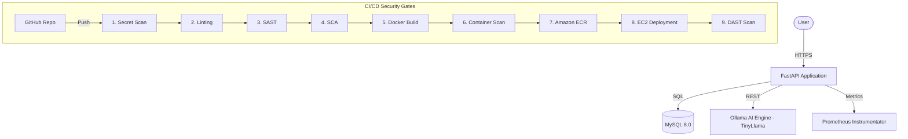

# 💰 AI-Powered Financial Tracker with DevSecOps Pipeline

[](https://github.com/Pradeepks01/AI-Powered-Financial-Tracker-with-DevSecOps-Pipeline/actions)
[](https://github.com/Pradeepks01/AI-Powered-Financial-Tracker-with-DevSecOps-Pipeline/security)
[](LICENSE)
[](https://www.python.org/)
[](https://fastapi.tiangolo.com/)

**A premium, state-of-the-art financial management tool with an integrated AI advisor, secured by an industry-leading DevSecOps pipeline on Amazon AWS.**

---

## 🏗️ Architecture Overview

The system follows a modern microservices-lite architecture, leveraging FastAPI for high-performance asynchronous operations and a self-hosted AI engine for privacy-focused financial insights.



---

## 🌟 Key Features

- **🧠 AI Financial Advisor**: Context-aware assistance powered by **Ollama (TinyLlama)**. Get personalized advice on spending habits and savings goals.
- **🌓 Premium UI/UX**: Stunning **Glassmorphism** dashboard built with Tailwind CSS and Vanilla JS. Full Dark/Light mode support.
- **🔐 Enterprise-Grade Auth**: Secure authentication flow using **JWT (JSON Web Tokens)** and **BCrypt** password hashing.
- **📊 Real-time Observability**: Integrated **Prometheus** metrics endpoint for monitoring application health and performance.
- **🛡️ Secure-by-Design**: Every commit is subjected to 9 sequential security gates before reaching production.

---

## 🛡️ DevSecOps Pipeline

Our pipeline enforces a "Shift-Left" security strategy, ensuring that vulnerabilities are identified and mitigated early in the development lifecycle.

| Stage | Tool | Category | Description |
| :--- | :--- | :--- | :--- |
| **1. Secret Scan** | **Gitleaks** | Secrets | Detects hardcoded credentials, API keys, and tokens. |
| **2. Code Lint** | **Flake8** | Quality | Enforces PEP8 standards and identifies syntax errors. |
| **3. SAST** | **Semgrep** | Static Analysis | Scans source code for security patterns and OWASP vulnerabilities. |
| **4. SCA** | **Pip-audit** | Dependencies | Identifies known CVEs in third-party Python packages. |
| **5. Build** | **Docker** | Packaging | Creates a multi-stage, optimized production image. |
| **6. Image Scan** | **Trivy** | Container | Scans the container image for OS-level vulnerabilities. |
| **7. Image Registry**| **Amazon ECR**| Storage | Securely stores verified container images. |
| **8. Deployment** | **Docker Compose**| CD | Automated rollouts to Amazon EC2 via GitHub Actions. |
| **9. DAST** | **OWASP ZAP** | Dynamic Analysis| Performs active security testing against the running app. |

---

## 📂 Project Structure

```text
├── .github/workflows/    # CI/CD & DevSecOps Pipeline Definitions
├── scripts/              # Infrastructure and utility scripts
├── src/                  # Backend Logic (FastAPI)
│   ├── api/              # Route handlers (Auth, Chat, Entries, Accounts)
│   ├── core/             # Security (JWT, Hashing) and Config
│   ├── db/               # Database schemas and Session management
│   ├── models/           # SQLAlchemy Data Models
│   ├── schemas/          # Pydantic validation schemas
│   └── services/         # Business logic layer
├── templates/            # Frontend (Glassmorphism HTML/JS)
├── app-tier.yml          # Production Docker Compose stack
├── docker-compose.yml    # Local Development stack
├── Dockerfile            # Optimized Multi-stage Docker build
└── requirements.txt      # Python dependencies
```

---

## 🚀 Getting Started

### 1. Local Development
Ensure you have Docker and Docker Compose installed:

```bash
# Clone the repository
git clone https://github.com/Pradeepks01/AI-Powered-Financial-Tracker-with-DevSecOps-Pipeline.git
cd AI-Powered-Financial-Tracker-with-DevSecOps-Pipeline

# Start the application
docker-compose up --build
```
The application will be available at `http://localhost:8000`.

### 2. Deployment Setup
To deploy to AWS, ensure you have the following secrets configured in GitHub:
- `AWS_ACCESS_KEY_ID` & `AWS_SECRET_ACCESS_KEY`
- `AWS_REGION`
- `AWS_ROLE_ARN` (for OIDC authentication)
- `EC2_HOST` & `EC2_USERNAME`
- `SSH_PRIVATE_KEY`

---


